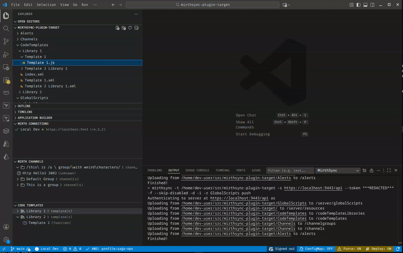
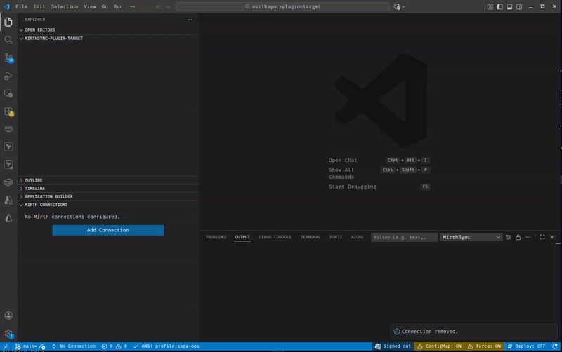
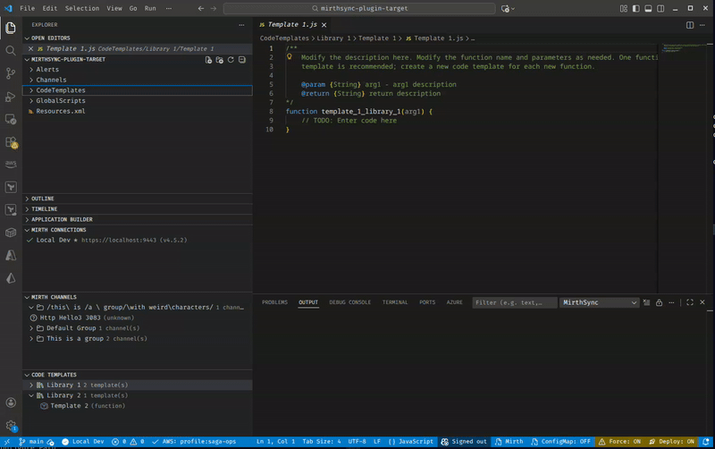
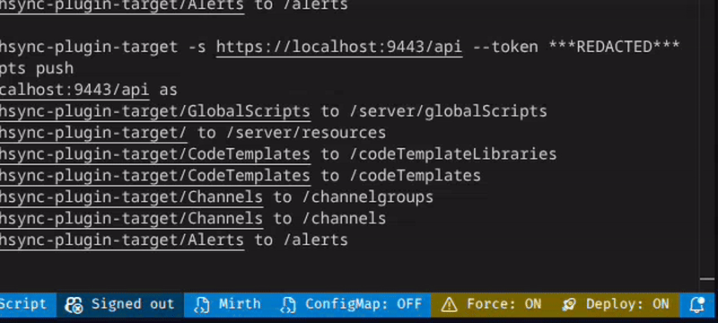

# MirthSync for VS Code

Professional Mirth Connect development environment - sync channels, IntelliSense, and dev containers.

**By [Saga IT, LLC](https://saga-it.com)**

> **Note:** This is a community extension developed by Saga IT, LLC. It is not affiliated with or endorsed by NextGen Healthcare.

## Installation

Install from the [VS Code Marketplace](https://marketplace.visualstudio.com/items?itemName=SagaITLLC.mirthsync).

## Features

- **Channel & Template Sync** - Pull/push individual channels, channel groups, code template libraries, or sync all at once
- **Connection Management** - Multi-server connection profiles with secure credential storage (VS Code Secrets API)
- **IntelliSense** - Autocomplete and hover documentation for Mirth JavaScript APIs

  
- **Status Bar Controls** - Quick toggles for ConfigMap inclusion, Force sync, and Deploy after push
- **File Explorer Integration** - Right-click on Channels/CodeTemplates folders to pull/push directly
- **Tree Views** - Browse channels and code templates hierarchically with context menu actions
- **Dev Container** *(Coming Soon)* - Docker-based local OIE development environment

## Quick Start

1. Install the extension from the VS Code marketplace (or from VSIX)
2. Open Command Palette (`Ctrl+Shift+P` / `Cmd+Shift+P`)
3. Run **MirthSync: Add Connection** and enter your Mirth server details
4. Set the connection as active and connect
5. Use tree views or commands to pull/push channels



## Commands

### Connection Management

| Command | Description |
|---------|-------------|
| `MirthSync: Add Connection` | Add a new Mirth server connection |
| `MirthSync: Test Connection` | Test the selected connection |
| `MirthSync: Refresh Connections` | Refresh the connections tree view |

### MirthSync Operations

| Command | Description |
|---------|-------------|
| `MirthSync: Pull All` | Pull all channels and templates from server |
| `MirthSync: Push All` | Push all local changes to server |
| `MirthSync: Git Status` | Show git status of mirthsync workspace |
| `MirthSync: Git Diff` | Show git diff of changes |
| `MirthSync: Toggle ConfigurationMap Inclusion` | Toggle whether to include ConfigurationMap.xml |
| `MirthSync: Toggle Force Sync` | Toggle force overwrite on conflicts |
| `MirthSync: Toggle Deploy After Push` | Toggle automatic deployment after push |

### Tree View Context Menu Commands

| Command | Description |
|---------|-------------|
| `Pull Channel` | Pull a specific channel from server |
| `Push Channel` | Push a specific channel to server |
| `Pull Channel Group` | Pull all channels in a group |
| `Push Channel Group` | Push all channels in a group |
| `Pull Code Template Library` | Pull a template library from server |
| `Push Code Template Library` | Push a template library to server |
| `Pull Global Scripts` | Pull global scripts from server |
| `Push Global Scripts` | Push global scripts to server |

### Mirth CLI Operations

| Command | Description |
|---------|-------------|
| `MirthSync: Deploy Channel` | Deploy a channel on the server |
| `MirthSync: Undeploy Channel` | Undeploy a channel on the server |
| `MirthSync: Import Channel` | Import a channel from file |
| `MirthSync: Export Channel` | Export a channel to file |
| `MirthSync: Server Status` | Show Mirth server status |

## Settings

| Setting | Type | Default | Description |
|---------|------|---------|-------------|
| `mirthsync.mirthsyncPath` | string | `""` | Path to mirthsync executable. Leave empty to auto-detect. |
| `mirthsync.mirthcliPath` | string | `""` | Path to Mirth CLI executable. Leave empty to auto-detect. |
| `mirthsync.defaultTimeout` | number | `30000` | Default timeout for operations in milliseconds. |
| `mirthsync.outputVerbosity` | number | `1` | Verbosity level for mirthsync output (0-5). |
| `mirthsync.autoSavePresets` | boolean | `true` | Automatically save preset after successful operations. |
| `mirthsync.ignoreCertificateWarnings` | boolean | `false` | Ignore SSL certificate warnings (development only). |
| `mirthsync.javadocsUrl` | string | `""` | URL to Mirth javadocs for API generation. |
| `mirthsync.forceSync` | boolean | `false` | Force overwrite when syncing channels/templates. |
| `mirthsync.promptForForce` | boolean | `true` | Prompt to use force option when sync fails due to conflicts. |
| `mirthsync.includeConfigurationMap` | boolean | `false` | Include the Configuration Map when pulling or pushing. |
| `mirthsync.deployAfterPush` | boolean | `false` | Deploy channels immediately after pushing. |
| `mirthsync.skipDisabled` | boolean | `false` | Skip disabled channels when pushing. |

## Tree Views

The extension adds three tree views to the Explorer sidebar:

### Mirth Connections
Manage your Mirth server connections. Right-click for options:
- Connect/Disconnect
- Test Connection
- Set as Active
- Edit/Remove

### Mirth Channels
Browse channels organized by channel groups (visible when connected). Right-click to:
- Pull/Push individual channels
- Pull/Push entire channel groups

### Code Templates
Browse code template libraries (visible when connected). Right-click to:
- Pull/Push individual templates
- Pull/Push entire libraries


## File Explorer Integration

When connected, right-click on folders in the file explorer to sync:
- `Channels/` - Pull or push channel configurations
- `CodeTemplates/` - Pull or push code template libraries
- `GlobalScripts/` - Pull or push global scripts
- `ConfigurationMap.xml` - Pull or push configuration map
- `Resources.xml` - Pull or push resources



## Status Bar

The status bar shows:
- **Connection status** - Current active connection and state
- **ConfigMap** - Whether Configuration Map is included (click to toggle)
- **Force** - Whether force sync is enabled (click to toggle)
- **Deploy** - Whether deploy after push is enabled (click to toggle)



## Requirements

- VS Code 1.85.0 or higher
- [mirthsync](https://github.com/SagaHealthcareIT/mirthsync) CLI tool (for sync operations)
- Mirth Connect 4.5.2+ or [Open Integration Engine (OIE)](https://github.com/OpenIntegrationEngine/engine)

### Compatibility

This extension works with:
- **Mirth Connect** - The commercial integration engine by NextGen Healthcare
- **Open Integration Engine (OIE)** - The open source community edition (formerly Mirth Connect Open Source)

Both use the same underlying API, so MirthSync works seamlessly with either.

### Installing mirthsync

The preferred method is via npm:

```bash
npm install -g @saga-it/mirthsync
```

Alternatively, download from [GitHub releases](https://github.com/SagaHealthcareIT/mirthsync/releases).

## Related Projects

- [mirthsync](https://github.com/SagaHealthcareIT/mirthsync) - CLI tool for syncing Mirth configurations
- [Open Integration Engine (OIE)](https://github.com/OpenIntegrationEngine/engine) - Open source integration engine

## License

Copyright (c) 2024-2026 Saga IT, LLC. All Rights Reserved.

This is proprietary software. See the extension's LICENSE file for details.
